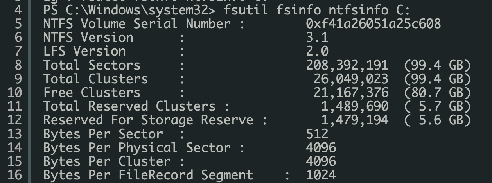

## Environment Variables
On the Windows platform, Oracle Universal Installer (OUI) automatically assigns values to ORACLE_BASE, ORACLE_HOME and ORACLE_SID in the Windows registry.

**ORACLE_HOME** - C:\oraclexe\app\oracle\product\11.2.0\server
**ORACLE_BASE** - C:\oraclexe\app\oracle

## Schema
A schema is the set of database objects (tables, indexes, views, etc) that belong to a user. A database user owns a database schema, which has the same name as the user name.

## Logical Storage Structures

### Data blocks
Data blocks are the smallest units of storage that oracle can
use or allocate. One logical data block corresponds to a
specific number of bytes of physical disk space. Each
operating system has what is called a block size. Oracle
requests data in multiples of Oracle blocks, not operating
system blocks. Therefore, you should set the Oracle block size to a multiple of the operating system block size to avoid unnecessary I/O. Usually 8 kb



### Extents
Extents are the logical unit of database which is made of contiguous multiple numbers of the oracle data blocks. Default is 1 MB

### Segments
A segment is a set of extents which has been allocated for a specific data structure and all of which are stored in the same tablespace. For example, each table's data is stored in its own data segment, while each index's data is stored in its own index segment. If the table or index is partitioned, each partition is stored in its own segment. Whenever the existing space in a segment is completely used or full, oracle allocates a new extent for the segment. So the extents of a segment may or may not be contiguous on disk. The segments also can span datafiles, but the individual extents cannot.

### Tablespaces
Tablespaces are the bridge between physical and logical components of the Oracle database. A tablespace is made up of one or more database datafiles. The datafiles are created automatically when the tablespace is defined. When you create a tablespace, you define the initial size of the associated datafile.

## Types of Tablespaces
SYSTEM and SYSAUX tablespaces are always created when the database is created. The SYSTEM tablespace always contains the data dictionary tables for the entire database. The SYSAUX tablespace is an auxiliary tablespace to the SYSTEM tablespace.

### Permanent Tablespace
Contains persistent schema object. Data persist beyond the duration of a session or transaction. Objects in permanent tablespaces are stored in data files.

### Temporary Tablespace
Temporary tablespaces are used for special operations, particularly for sorting data results on disk and for hash joins in SQL. For SQL with millions of rows returned, the sort operation is too large for the RAM area and must occur on disk. The temporary tablespace is where this takes place.

### Undo Tablespace
- Oracle Database keeps records of actions of transactions, before they are committed. These information are used to rollback or undo the changes to the database. These records are called rollback or undo records.
- When the instance starts up, the database automatically selects for use the first available undo tablespace. If there is no undo tablespace available, the instance starts, but uses the SYSTEM rollback segment for undo. This is not recommended, and an alert message is written to the alert log file to warn that the system is running without an undo tablespace.
- Committed undo information normally is lost when its undo space is overwritten by a newer transaction.
- The default value for the UNDO_RETENTION parameter is 900 seconds. The system retains undo for at least the time specified in this parameter.
- You can set the UNDO_RETENTION in the parameter file: UNDO_RETENTION = 1800
```sql
SQL> ALTER SYSTEM SET UNDO_RETENTION = 2400;
```
- You can set **RETENTION** clause to either **GUARANTEE** or **NOGUARANTEE**. It specifies the database should preserve the unexpired undo data. This setting is useful if you need to issue an Oracle Flashback Query to correct a problem with the data. **RETENTION NOGUARANTEE** returns the undo behavior to normal. Space occupied by unexpired undo data in undo segments can be consumed if necessary by ongoing transactions. This is the default.
- You can create more than one undo tablespace but only one of them can be active at any given time.

### Small-file Tablespace
Default type of tablespace in Oracle database. Can have multiple data files. Maximum of 1022 data files are allowed.

### Big-file Tablespace
Suited for storing large amount of data. Allows maximum 1 data file

```sql
SELECT PROPERTY_VALUE FROM DATABASE_PROPERTIES
WHERE PROPERTY_NAME = 'DEFAULT_PERMANENT_TABLESPACE'; 
----
SELECT PROPERTY_VALUE FROM DATABASE_PROPERTIES
WHERE PROPERTY_NAME = 'DEFAULT_TEMP_TABLESPACE';
----
ALTER DATABASE DEFAULT TABLESPACE tbs_perm_01;
ALTER DATABASE DEFAULT TEMPORARY TABLESPACE tbs_temp_01; 
----
CREATE TABLE tbl_tblspace (value1 NUMBER(2)) TABLESPACE SYSTEM;
```

```sql
CREATE SMALLFILE TEMPORARY TABLESPACE tblspce
TEMPFILE 'C:\oraclexe\app\oracle\oradata\XE\dtlfle1.dbf'SIZE 100M,
'C:\oraclexe\app\oracle\oradata\XE\dtlfle2.dbf' SIZE 100M AUTOEXTEND ON NEXT 500M
MAXSIZE UNLIMITED
EXTENT MANAGEMENT LOCAL UNIFORM SIZE 25M; 
----
SELECT file_name, tablespace_name FROM dba_data_files WHERE tablespace_name ='tblspce'; --To check number od datafile associated with tablespace
DROP TABLESPACE tblspce INCLUDING CONTENTS AND DATAFILES;
ALTER DATABASE DATAFILE 'C:\oraclexe\app\oracle\oradata\XE\dtlfle1.dbf' OFFLINE DROP; ALTER DATABASE DATAFILE 'C:\oraclexe\app\oracle\oradata\XE\dtlfle1.dbf' RESIZE 8M;
```

```sql
CREATE SMALLFILE TABLESPACE tblspce -- TEMPORARY TABLESPACE for temporary tablespace; UNDO TABLESPACE for undo tablespace
DATAFILE 'C:\app\oradata\dtlfle1.dbf' --TEMPFILE for temporary tablespace. DATAFILE for permenant tablespace and undo tablespace
SIZE100M --M for MB;G for GB;T for TB 'C:\app\oradata\dtlfle2.dbf' SIZE 100M
AUTOEXTEND ON NEXT 500M --Extend it by 500 MB after the file gets filled
MAXSIZE UNLIMITED
RETENTION NOGUARANTEE --Only for undo tablespace
LOGGING --LOGGING = Create logs for creation of tables, indexes, inserts etc.. Not available for undo and temporary tablespace
        --NO LOGGING = Does not create logs
EXTENT MANAGEMENT LOCAL UNIFORM SIZE 25M--UNIFORM = Allocate extents in the tablespace with same size. Should be less than datafile size. Default for TEMPORARY tablespace; Not available for undo tablespace.
    --AUTOALLOCATE = System will decide the size of extent allocation
SEGMENT SPACE MANAGEMENT AUTO;--MANUAL/AUTO; Not available for temporary tablespace and undo tablespace
----
CREATE SMALLFILE TABLESPACE tblspce
DATAFILE 'C:\oraclexe\app\oracle\oradata\XE\dtlfle1.dbf'SIZE 100M, 'C:\oraclexe\app\oracle\oradata\XE\dtlfle2.dbf' SIZE 200M AUTOEXTEND ON NEXT 500M
MAXSIZE UNLIMITED
LOGGING
EXTENT MANAGEMENT LOCAL UNIFORM SIZE 25M SEGMENT SPACE MANAGEMENT AUTO;
----
CREATE SMALLFILE UNDO TABLESPACE tblspce
DATAFILE 'C:\oraclexe\app\oracle\oradata\XE\dtlfle1.dbf'SIZE 100M,
'C:\oraclexe\app\oracle\oradata\XE\dtlfle2.dbf' SIZE 100M AUTOEXTEND ON NEXT 500M
MAXSIZE UNLIMITED
RETENTION GUARANTEE;
```

## Physical Database Limits

|Item|Type of Limit|Limit Value|
|--- |--- |--- |
|Columns|Maximum per table|1000|
|Columns|Maximum per index (or clustered index)|32|
|Columns|Maximum per bitmapped index|30|
|Constraints|Maximum per column|Unlimited|
|Constraints|Maximum per database|4,294,967,293|
|Database users|Maximum per database|4,294,967,293|
|Dictionary-managed database objects|Maximum per database|4,254,950,911 - overhead|
|Indexes|Maximum per table|Unlimited|
|Indexes|Total size of indexed column(s)|Approximately 75% of the database block size minus some overhead|
|Partitions|Maximum length of linear partitioning key|4 KB - overhead|
|Partitions|Maximum number of columns in partition key|16 columns|
|Partitions|Maximum number of partitions allowed per table or index|1024K - 1|
|Rows|Maximum number per table|Unlimited|
|Stored Packages|Maximum size|Approximately 6,000,000 lines of code.|
|Subpartitions|Maximum number of subpartitions in a composite partitioned table|1024K - 1|
|Subqueries|Maximum levels of subqueries in a SQL statement|Unlimited in the FROM clause of the top-level query; 255 subqueries in the WHERE clause|
|System Change Numbers (SCNs)|Maximum|263 - 248 = 9,223,090,561,878,065,152 SCNs|
|Tables|Maximum per clustered table|32 tables|
|Tables|Maximum per database|Unlimited|
|Trigger Cascade Limit|Maximum value|Operating system-dependent, typically 32|
|Users and Roles|Maximum|2,147,483,638|

## Physical Storage Structures

### Data files
Every Oracle database has one or more physical data files, which contain all the database data. The data of logical database structures, such as tables and indexes, is physically stored in the data files.

### Control files
Control file is a binary file which contains metadata specifying the physical structure of the database, including the database name and the names and locations of the database files.

### Online redo log files
It is a set of two(minimum) or more log files. Oracle will write every change made in the database into the first log file, and when the first log file is full, Oracle will switch to the second log file and write. We can have multiple group of redo log files to keep mirrored copies.

### Archived redo log files
An Oracle database can run in one of two modes. By default, the database is created in NOARCHIVELOG mode. In this mode, it will overwrite the redo log file once they are filled. In ARCHIVELOG mode, database archive all redo log files once they are filled instead of overwriting them.

```sql
SQL> ARCHIVE LOG LIST; -- To check whether Archive Log Mode is enabled or not SQL> SELECT log_mode FROM v$database
SQL> SHUTDOWN IMMEDIATE; --To enable Archive Log Mode
SQL> STARTUP MOUNT;
SQL> ALTER DATABASE ARCHIVELOG; SQL> ALTER DATABASE OPEN;
```

### Parameter files
To start a database instance, Oracle Database must read either a server parameter file(**SPFILE** - % ORACLE_HOME%\dbs\spfile%ORACLE_SID%.ora), which is recommended, or a text initialization parameter file (**PFILE** - %ORACLE_HOME%\database\init%ORACLE_SID%.ora). These files contain a list of configuration parameters like SGA size, name of database, name and location of database control files for that instance and database. SPFILE is binary file and only Oracle database can read or write into that file. You can modify the parameter's values with the **ALTER SYSTEM SET** command.
**MAXDATAFILES** specifies the maximum number of datafiles that can be open in the database. 
**MAXINSTANCES** specifies that only one instance can have this database mounted and open.

```sql
SQL> STARTUP PFILE = 'C:\ora\pfile\init.ora'
SQL> CREATE SPFILE FROM PFILE = 'C:\ora\pfile\init.ora' 
SQL> CREATE PFILE = 'C:\ora\pfile\init.ora' FROM SPFILE 
SQL> CREATE SPFILE FROM MEMORY
```

### Password file
Stores passwords for users with administrative privileges.
Location: %ORACLE_HOME%\database\PWD%ORACLE_SID%.ora

### Networking files
These files are used to configure the different network components of the Oracle database. These include files such as tnsnames.ora and listener.ora. The "listerner.ora" file contains server side network configuration parameters. The "tnsnames.ora" file contains client side network configuration parameters.
Location: %ORACLE_HOME%\network\ADMIN

### IO Error : The Network Adapter could not establish connection

```sql
CMD> lsnrctl status -- to check the status of listener 
CMD> lsnrctl start -- to start listener
```

### Trace file (.trc)
Trace File are trace (or dump) file that Oracle Database creates to help you diagnose and resolve operating problems. Each server and background process writes to a trace file. When a process detects an internal error, it writes information about the error to its trace file.

### Alert log
The alert log file is a chronological log of messages and errors written out by an Oracle Database. Typical messages found in this file is: database startup, shutdown, log switches, space errors, etc. This file should constantly be monitored to detect unexpected messages and corruptions. Location:%ORACLE_BASE%\diag\rdbms\%ORACLE_SID%\%ORACLE_SID%\trace

```sql
SQL> SHOW PARAMETER background
```

### System Change Number (SCN)
SCN (System Change Number) is a primary mechanism to maintain data consistency in Oracle database. Every time a user commits a transaction, Oracle records a new SCN. The SCN_TO_TIMESTAMP function can be used to map between the SCN to a point in time. ORA_ROWSCN pseudo column is useful for determining approximately when a row was last updated.

```sql
SQL> SELECT CURRENT_SCN FROM V$database;
SQL> SELECT SCN_TO_TIMESTAMP(ORA_ROWSCN) FROM employees;
SQL> SELECT ORA_ROWSCN, last_name FROM employees WHERE employee_id = 188;
```

## Memory Architecture

### System global area (SGA)
System Global Area forms the part of the system memory shared by all the processes belonging to a single Oracle database instance. Each database instance has its own SGA. To start an instance: 

```sql
SQL> STARTUP
```

#### SGA contain:
- Database buffer cache: Any data coming in or going out of the database will pass through the buffer cache. When Oracle receives a request to retrieve data, it will first check if the data is already in the buffer. This practice allows server to avoid unnecessary I/O.
- Shared pool: The shared pool is like a buffer for SQL statements. It contains Oracle's library cache, which is responsible for collecting, parsing, interpreting, and executing all of the SQL statements. In library cache we have Shared SQL Areas and Private SQL Area (Shared Server Mode Only). Oracle represents each SQL statement it executes with a shared SQL area and a private SQL area. Oracle recognizes when two users are executing the same SQL statement and reuses the same shared part for those users. However, each user must have a separate copy of the statement's private SQL area. A shared SQL area is a memory area that contains the parse tree and execution plan for a single SQL statement. A private SQL area is a memory area that contains data such as bind information and runtime buffers. Each session that issues a SQL statement has a private SQL area. Many private SQL areas can be associated with the same shared SQL area.
- Redo log buffer: The server processes generate redo data into the log buffer as they make changes to the data blocks in the buffer. LGWR subsequently writes entries from the redo log buffer to the online redo log. LGWR initiates a flush of this area in one of the following scenarios: Every three seconds, Whenever someone commits, When LGWR is asked to switch log files, When the redo buffer gets one-third full or contains 1MB of cached redo log data

### Program global area (PGA)
A PGA is a non-shared memory region which is private to each server and background process; that contains a private SQL area (Dedicated Server Mode Only) and a session memory area (in UGA). There is one PGA for each process. Do not confuse a private SQL area, which is in the PGA, with the shared SQL area, which stores execution plans in the SGA. Multiple private SQL areas in the same or different sessions can point to a single execution plan in the SGA. Session memory is the memory allocated to hold a session's variables (logon information) and other information related to the session.

### User global area (UGA)
The UGA is memory area associated with a user session which allocates memory for session variables, such as logon information, session state, and other information required by a database session. For dedicated sessions, the UGA is a part of PGA and for shared sessions, the UGA is inside the SGA.

## Dedicated vs. Shared Server Process
In Dedicated server process, each client process connects to a dedicated server process. If you have 100 dedicated server connections, there will be 100 processes (PGA) executing on their behalf.
In Shared server process, the database uses a pool of shared server processes for multiple sessions. A client process communicates with a dispatcher, which is a process that enables many clients to connect to the same database instance without the need for a dedicated server process for each client.

## Background Processes

**SMON:** System Monitor recovers after instance failure and monitors temporary segments and extents. 

**PMON:** Process Monitor recovers failed process resources.

**DBWR:** Database Writer or Dirty Buffer Writer process is responsible for writing dirty buffers from the database buffer cache to the database data files. Generally, DBWR only writes blocks back to the data files on commit, or when the cache is full and space has to be made for more blocks.

**LGWR:** Log Writer process is responsible for writing the log buffers out to the redo logs. 

**ARCn:** The optional Archive process writes filled redo logs to the archive log location(s).